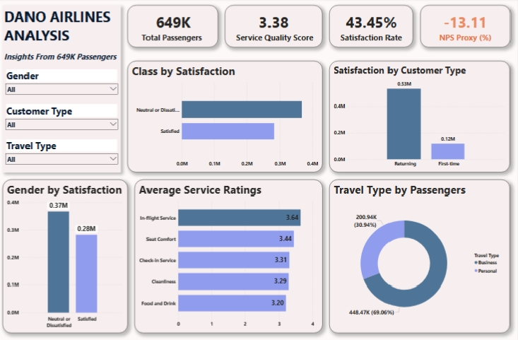

# Dano_Airlines_-Analysis-
Capstone project on Dano Airlines 

✈️ Dano Airlines Passenger Satisfaction Dashboard
This project presents an interactive analysis of Dano Airlines’ passenger satisfaction data using Power BI. The dashboard gives insights into passenger feedback, service quality, and satisfaction trends across different demographics and travel types.

📸 Dashboard Preview! 

🔍 Key Highlights

- Total Passengers: 649K  
- Service Quality Score: 3.38  
- Satisfaction Rate: 43.45%  
- NPS Proxy: -13.11%

📌 Dashboard Features

- Satisfaction Breakdown by Class, Gender, and Customer Type  
- Average Ratings of key service features like Seat Comfort, Food, Cleanliness, etc.  
- Interactive Filters: Gender, Customer Type, Travel Type  
- Visual Types Used: Bar Charts, Donut Chart, KPI Cards  

🛠 Tools Used

- Power BI Desktop (.pbix)
- DAX for calculated metrics
- Data Cleaning* in Power Query

📁 Files Included

- `Dano_Airlines_Dashboard.pbix` – Power BI file
